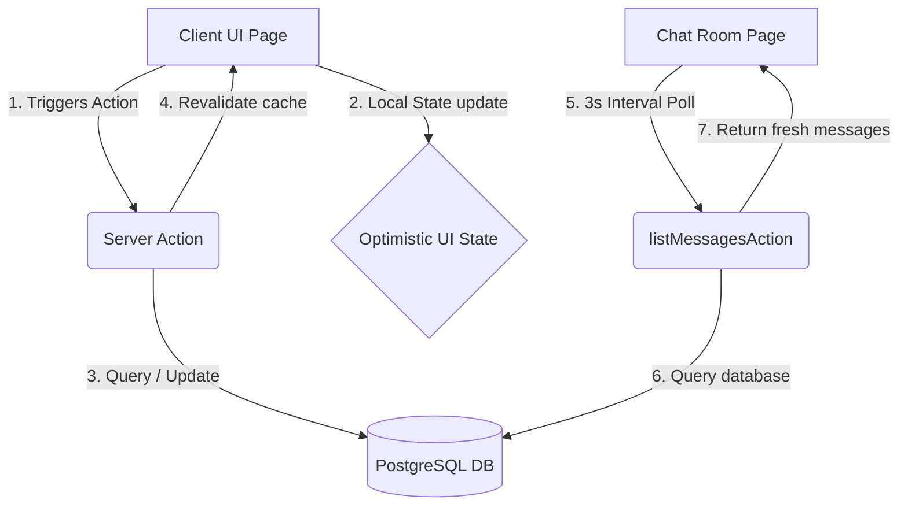

# Technical Architecture Manual

This document details the software architecture, coding patterns, directory layouts, and design choices of the Nexus platform.

## Technology Stack

* **Frontend Framework**: [Next.js](https://nextjs.org/) (App Router, Server Components, and Server Actions).
* **Styling**: Tailwind CSS & Vanilla CSS with CSS variables (`globals.css`) for high-performance dark/light mode switches.
* **State Management**: React Context APIs (`ThemeProvider`) combined with local React hooks (`useState`, `useTransition`, `useEffect`) and Server Actions for data syncing.
* **Database & ORM**: PostgreSQL database mapped via [Prisma ORM](https://www.prisma.io/).
* **Authentication**: [NextAuth.js v5](https://next-auth.js.org/) (Auth.js) using Credentials Provider and JWT tokens.
* **UI Component Library**: Shadcn UI built on Radix primitives.

---

## Directory Structure & Component Organization

The application code is located in the `src/` directory, following a clean, feature-driven structure:

```
src/
├── app/                        # Next.js App Router (Pages, API Endpoints, Layouts)
│   ├── api/                    # API endpoints (GitHub webhook, Auth endpoints)
│   ├── workspaces/             # Protected workspace views (settings, activity, chat, boards)
│   └── globals.css             # Main styling entry point with Obsidian/Paper theme CSS variables
├── components/                 # Global, reusable UI and layout elements
│   ├── ui/                     # Shadcn components (Dialog, Avatar, Input, Button, Tabs, select)
│   ├── app-header.tsx          # Top navbar display
│   ├── theme-provider.tsx      # Dark/light theme switch context
│   └── webhook-config.tsx      # GitHub webhook settings card
├── features/                   # Domain-driven features directory (holds page business logic)
│   ├── workspace/              # Workspace manager list, settings tabs, member directories
│   ├── chat/                   # Broadcast chatroom viewports, message lists, and inputs
│   ├── board/                  # Kanban board columns, cards, and drag drop containers
│   ├── task/                   # Task checklist dialog forms and timer stopwatches
│   └── activity/               # Workspace activity feed logs list view
├── generated/                  # Generated database schema classes (Prisma Client outputs)
├── lib/                        # Shared utility libraries (Auth options, label constants, schemas)
└── server/                     # Backend code
    └── actions/                # Server Actions (Chat actions, workspace actions, time logger)
```

---

## Data Synchronization Strategy

Nexus utilizes a hybrid real-time synchronization strategy:



1. **Short-Polling**: The chat room queries the database every 3 seconds to retrieve new messages and message reactions. This eliminates the need for maintaining stateful WebSockets servers.
2. **Server Actions**: Mutations (creating workspaces, updating projects, stopping timers) are dispatched directly using Next.js Server Actions.
3. **Cache Revalidations**: After mutations resolve, `revalidatePath` or `revalidateTag` is called, instructing the Next.js server to automatically push fresh data to Server Components.
